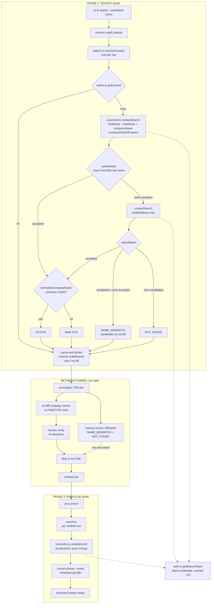

# Salesforce Contact Auditor — Architecture

**Scale:** Single-operator CLI script. ~2,880 contacts. Two phases, run as two separate commands.

---

## 1. What it does

Takes a spreadsheet of Salesforce contacts (name + company), checks each one against ZoomInfo,
and flags them `ACTIVE`, `INACTIVE`, or `NOT_FOUND`. The point is to remove the human from the
task — no manual ZoomInfo searching.

**Phase 1 — Search** _(build this)_
Contact Search, one call per row. Determines status. Writes an annotated sheet + prints a summary.

**Phase 2 — Enrich** _(later, separate command)_
Contact Enrich, run against a _trimmed_ sheet containing only contacts phase 1 confirmed exist.
Pulls current title / email / phone. Kept as a separate entry point so it cannot fire by accident
and burn credits.

Out of scope: web UI, Salesforce write-back, job queue, database. None of them earn their keep here.

---

## 2. Structure

```
salesforce-contact-auditor/
├── src/
│   ├── cli.ts         # The only entry point.  npm run dev -- search data/input/contacts.xlsx
│   ├── search.ts      # Phase 1 workflow — runSearch(inputFile), dispatched by cli.ts
│   ├── enrich.ts      # Phase 2 workflow — NOT COMPLETED YET; cli.ts throws on the subcommand.
│   ├── auth.ts        # getBearerToken() — the token seam. See §6 step 3.
│   ├── zoominfo.ts    # contactSearch() + request-level throttle. contactEnrich() later.
│   ├── excel.ts       # readContacts() + writeResults() — both built
│   └── cache.ts       # ~10 lines. Keyed JSON file. See §5.
├── dist/              # tsc output, gitignored. npm start runs dist/cli.js.
├── data/              # GITIGNORED — real people's PII. Verified: test.xlsx is ignored.
│   ├── input/
│   ├── output/
│   └── cache/
├── .env               # CLIENT_ID / CLIENT_SECRET — Client Credentials Flow, exchanged for a
│                      # short-lived bearer token by auth.ts and cached in memory until near expiry
├── .env.example       # Committed. No real values.
├── names.csv          # Nickname → formal-name lookup for a future nickname rule. Unused by src/.
└── README.md          # The handoff artifact — see §7.
```

### Code flow

Exported renders live at `docs/Architecture_Diagram.svg` / `.png`; this block is the editable
source (GitHub renders it inline).



**Runtime dependencies:** `exceljs`, `dotenv`. Native `fetch`. (`chalk` was dropped — plain
console output is enough for a single-operator CLI.)
**Toolchain:** TypeScript strict; `tsx` runs the dev loop (`npm run dev -- <command> <file>`), `tsc`
builds to `dist/` (`npm start`). CommonJS package (ESM `import` syntax, compiled to `require`) with
`nodenext` module resolution. (The original reason for `nodenext` — chalk 5 being ESM-only, which
`node16` resolution can't `require()` — left with chalk; the setting stays because it's current and
harmless.)

No test framework, no CLI framework (arg parsing is `parseArgs` from `node:util`), no validation
library, no rate-limit library. **Rate limiting** is a hand-rolled request-level throttle in
`zoominfo.ts` (`throttle()` + a module-level `nextSlot`): every request reserves the next time slot
synchronously before awaiting, so concurrent callers get spaced out instead of bursting. ZoomInfo's
documented limits are 25 req/s, 54,000/hr, 648,000/day; only the per-second limit binds a single run
(2,880 rows + fallbacks ≈ 5,760 requests, far under the hourly/daily caps), and the throttle paces to
**20 req/s** for headroom — pacing at exactly 25 trips 429s on jitter/clock-skew. A full run is
~2.5–5 minutes.

> **Superseded design (2026-07-21):** this section used to read "rate limiting is four lines: send 25,
> wait a second, repeat," done at the chunk level in `search.ts`. That undercounted — each contact
> fires 1–2 requests (name+company, then the email fallback), so a 25-contact chunk was 25–50
> requests, and `Promise.all` fired them as a burst rather than paced. Both caused 429s. Throttling
> moved to the request level (every request passes through `contactSearch`, fallbacks included) so the
> limit counts requests, not contacts. **Removed (2026-07-23):** the chunk loop is gone — `runSearch`
> now maps every contact straight through `processContact`, each request paced by the throttle.

**One entry point, not two.** An earlier revision of this doc specced separate entry files per phase
so enrich could never fire by accident. The design moved to a single `cli.ts` routing `search` /
`enrich` subcommands — the guard survives because `enrich` is an explicit command that throws until
phase 2 is deliberately built. cli.ts validates user input at the boundary (file must exist, command
must be known) and owns the single top-level `.catch` that prints errors and sets the exit code;
workflow modules trust their inputs and communicate failure by throwing.

---

## 3. Phase 1: the status check

### Input schema (confirmed against the real export)

The real export (`data/input/ContactExport.xlsx`) is a multi-tab workbook, not a single sheet:
per-person contact tabs (`Carter`, `Zoe`, `Kylie`), plus `Account List` and `Summary` (unused).
The tab is chosen at the CLI (`--worksheet <name>` / `-w`, required for `search`; built 2026-07-27):
the name threads through **both** `readExcelSheet` callers — `readContacts()` and `writeResults()` —
so read and write always target the same tab, and it names the output file
(`data/output/annotated_<tab>.xlsx`) so tabs never clobber each other. A missing tab errors with the
workbook's actual worksheet names. All three tabs ran clean on 2026-07-27 — see §6.

Column layout on a contact tab, confirmed live (`B`, `E`, `K` are hidden in Excel — invisible when
reading the header row by eye, but present and readable via ExcelJS same as any other column):

| Col | Header                  | Col | Header                           | Col | Header             |
| --- | ----------------------- | --- | -------------------------------- | --- | ------------------ |
| A   | Account Last Update     | H   | Account ID                       | O   | Phone              |
| B   | Contact ID _(hidden)_   | I   | Account Name                     | P   | Mobile             |
| C   | First Name              | J   | Account Owner                    | Q   | Email              |
| D   | Last Name               | K   | Account: Created Date _(hidden)_ | R   | Last Modified By   |
| E   | Contact Name _(hidden)_ | L   | Contact Status                   | S   | Last Modified Date |
| F   | Created Date            | M   | Title                            | T   | Email Opt Out      |
| G   | Created By              | N   | Department                       | U   | NOTES              |

`V` through `AC` were confirmed empty on all three contact tabs — the tool writes `V`–`AB` there.
**Existing columns (A–U) are never modified**, including `L`
(`Contact Status`) — that's a CRM-managed field, not this tool's to overwrite. See Output columns
below.

**Endpoint:** `POST https://api.zoominfo.com/gtm/data/v1/contacts/search` (JSON:API —
`content-type: application/vnd.api+json`). One contact per request; **no batching**. ~2,880 rows +
fallbacks, paced at 20 req/s ≈ 2.5–5 minutes (see §2 rate limiting).

```jsonc
{
  "data": {
    "type": "ContactSearch", // ← exact casing required; "contactSearch" returns 400
    "attributes": {
      "firstName": "Paul",
      "lastName": "Adams",
      "companyName": "CrunchTime! Information Systems Inc",
      "companyPastOrPresent": "pastAndPresent", // ← the whole design rests on this
    },
  },
}
```

The email fallback (§ "Search field fallback") sends a single `"emailAddress"` attribute instead —
**`email` is not a valid field name** and returns `400 PFAPI0005 "Invalid field requested"` (learned
live 2026-07-21). `contactSearch()` builds `attributes` from whatever partial criteria it's given and
adds `companyPastOrPresent` only when a `companyName` is present.

`pastAndPresent` widens _what the search matches on_ (present **or** past employment) while the
response still reports _where the person is now_. That collapses all three statuses into one call.

**Verified against the live API.** Searching a contact who has left `CrunchTime!` returns:

```jsonc
{
  "data": [
    {
      "id": "14062844524", // ← personId. Phase 2's key.
      "attributes": {
        "company": { "id": 557414001, "name": "Blue Mountain" }, // ← PRESENT company, not the matched one
        "jobTitle": "Chief Information Security Officer", // ← free. Capture it.
        "contactAccuracyScore": 98,
        "hasEmail": true,
        "hasMobilePhone": true, // ← booleans, not values. Enrich is the billable tier.
        "lastUpdatedDate": "2026-06-18T20:59:00Z",
        "validDate": "2026-07-08T20:38:00Z",
      },
    },
  ],
  "meta": { "totalResults": 1 },
}
```

The response reports the **present** employer, not the company that caused the match. This was the
one assumption that could have silently invalidated the design. It holds.

### Deriving status

**The acceptance rule (added 2026-07-27, `selectMatch` in `search.ts`):** ZoomInfo's search is fuzzy
— it _proposes_ candidates, it does not confirm identity. A candidate is **accepted** only when its
first name AND last name equal the sheet row's (case-insensitive, whitespace-trimmed, otherwise
character-exact). The check scans every returned candidate in order and applies identically to both
search paths (name+company and the email fallback). Rationale: phase 2 enriches by `personId` and
**updates Salesforce records** — a wrong-person match doesn't just mislabel a row, it overwrites a
real contact's data. A false `NOT_FOUND` costs a manual lookup; a false `ACTIVE` corrupts a record;
the tool fails toward the cheap error. Nicknames (`Mike` vs `Michael`), initials, and punctuation
variants are deliberately rejected — they land in `NAME_MISMATCH` for a human to confirm, not in the
verified set. (Fuzzy/edit-distance matching was measured and rejected — see §6, 2026-07-27.) A
nickname→formal-name lookup (`names.csv`, repo root) is committed for a future nickname-matching
rule; nothing in `src/` reads it yet.

| Condition                                         | Status                                                                                                    |
| ------------------------------------------------- | --------------------------------------------------------------------------------------------------------- |
| No candidate returned by either search            | `NOT_FOUND` — ZoomInfo has nothing for any field we hold                                                  |
| Candidates returned, none accepted                | `NAME_MISMATCH` — somebody close came back, identity unverified; best candidate's details kept for review |
| Accepted match, normalized `company` **==** input | `ACTIVE` (compare is normalized — see §4)                                                                 |
| Accepted match, normalized `company` **!=** input | `INACTIVE` — matched on past employment; they've moved on                                                 |
| `totalResults > 1`                                | First _accepted_ candidate wins (API default sort, `-relevance`); flagged in `Tool Notes`                 |

> **Not sorting by `contactAccuracyScore`** (decided 2026-07-21): the score measures ZoomInfo's
> confidence in a single profile's own data quality (employment + email currency), not whether that
> profile is the person actually being searched for — it can't tell two different same-named people
> at the same company apart any better than relevance can. Relying on the API's default `-relevance`
> sort and flagging every multi-match row in `notes` is honest about the ambiguity rather than
> pretending accuracy resolves it.

### Search field fallback (found live, 2026-07-20)

A single `firstName` + `lastName` + `companyName` search misses real contacts, because Salesforce
and ZoomInfo each carry an independent, sometimes-stale record of the same person — no one field is
reliably correct across every contact:

- One contact returned no hit on name alone, name + company, name + phone, or name + email — but hit
  immediately on email alone or phone alone. Cause: the Salesforce `First Name` is a nickname
  ("Cc"); ZoomInfo's record uses a different (likely formal) first name, so every name-based
  combination failed.
- A second contact hit cleanly on name + company but returned nothing once `email` was added to the
  same request. Cause: likely a stale Salesforce email — exactly the population this tool cares about
  most (people who've moved on).

Together these rule out "throw more fields into one request." ZoomInfo's search behaves like an
**AND** across whatever fields are provided, not an OR — combining fields narrows the match rather
than broadening it, so one wrong/stale field bundled in with correct ones can sink an otherwise-good
match.

**Design: sequential fallback, not a combined request.** Try `firstName` + `lastName` +
`companyName` first (cheapest, correct for the common case). If `totalResults === 0`, retry with
`emailAddress` alone. Only mark `NOT_FOUND` once every fallback with data available has come back empty.
`contactSearch()` needs to accept partial criteria (not a fixed argument list) so `search.ts` can
call it multiple times with different subsets — each attempt is its own request, not a combined one.
Phone is a candidate third fallback (it hit for the nickname case above); hold off building it until
email-only has been tried against the real run and judged insufficient.

> **Built (2026-07-21):** the sequential fallback is implemented in `processContact` — name+company
> first, then a single `emailAddress`-only retry when `totalResults === 0` and an email exists. The
> fallback field is `emailAddress`, not `email` (see the endpoint note above). Phone as a third
> fallback is still deferred, and the fallback hasn't been specifically re-verified against real
> nickname/stale-email cases post-fix — check that during the first full run.

> **Updated (2026-07-27):** the fallback now retriggers on **"no accepted match"** rather than
> `totalResults === 0`, so a wrong-person hit on name+company no longer blocks the email attempt.
> Fallback results pass through the same name check as everything else (measured earlier: the
> fallback carries ~14% of all matches, which is why it survived the restart).

### Output columns

Existing columns (A–U) untouched, per the input schema note above. New columns append starting at `V`:

| Column (header)                | Col | Source         | Notes                                                                                           |
| ------------------------------ | --- | -------------- | ----------------------------------------------------------------------------------------------- |
| `Inferred Contact Status`      | V   | derived        | `ACTIVE` / `INACTIVE` / `NAME_MISMATCH` / `NOT_FOUND` / `ERROR`                                 |
| `ZoomInfo Person ID`           | W   | candidate `id` | **Phase 2's key.** Write as **text** — `"14062844524"` as a number renders as `1.40628E+10`.    |
| `ZoomInfo Company Name`        | X   | `company.name` | Lets a human sanity-check every `INACTIVE`                                                      |
| `ZoomInfo Company ID`          | Y   | `company.id`   | Ground-truth company match; feeds the AI INACTIVE review (§4). Written as **text** — see below. |
| `ZoomInfo Title`               | Z   | `jobTitle`     | Free in search. Part of phase 2, already paid for.                                              |
| `Tool Notes`                   | AA  | derived        | Multi-match note, rejected-candidate count, or the error message when `status` is `ERROR`.      |
| `ZoomInfo Rejected Candidates` | AB  | derived        | `NAME_MISMATCH` only: up to 5 rejected candidates as `First Last (Company)` for eyeball review. |

On `NAME_MISMATCH` rows, W–Z are populated from the **best (first-returned) rejected candidate** —
deliberately, so a human who confirms the match has the `personId` in hand with no re-search. That
personId is **unverified by definition**; it is safe only because `verified.xlsx` / phase 2 consume
`ACTIVE` rows exclusively, and a mismatch row becomes `ACTIVE` only by explicit human edit.

The V and AA headers were renamed (2026-07-27) from `Contact Status` / `Notes` to avoid duplicate
header names against Salesforce's own columns `L` (`Contact Status`) and `U` (`NOTES`) — anything
keying on header text would otherwise resolve ambiguously.

> **Built (2026-07-23).** `writeResults(inputPath, outputPath, results)` re-opens the input workbook
> and appends columns V–AA keyed by `rowNumber`, leaving A–U (and every other tab) untouched, then
> saves to a separate file under `data/output/` (a guard rejects `inputPath === outputPath`). Both
> `personId` (W) and `zi_company_id` (Y) are written as **strings**, not numbers — otherwise a long
> all-digit ID renders as `1.40628E+10`, and even a shorter ID falls back to scientific notation in a
> narrow General-format column. `search.ts` **awaits** the call so a write failure (e.g. the output
> file open in Excel) surfaces through cli.ts's error net instead of an unhandled rejection.

Then: filter to `status = ACTIVE`, save as `verified.xlsx` — that's phase 2's input.

**Why `personId` matters:** Enrich accepts it as a match input, so phase 2 becomes an exact lookup.
Without it, phase 2 redoes phase 1's name+company matching from scratch — and can arrive at a
_different_ answer than phase 1 did.

---

## 4. The one design risk left: company names don't match across systems

`Acme Corp` · `Acme Corporation` · `Acme Corp.` · `ACME`

Salesforce and ZoomInfo do not agree on company names. A naive `===` marks an active contact as
`INACTIVE`. This is now the **only** remaining soft spot in the design — and the API response hands
over the fix: **`company.id`**. Compare IDs, not strings.

Build the ID map for free, in two passes, with zero extra API calls:

1. **Pass 1** — normalized string compare (lowercase, strip punctuation and `Inc / Corp / LLC / Ltd
/ Co`). Every clean match teaches you `"CrunchTime! Information Systems Inc" → 557414001`. The
   2,880 contacts map to only a few hundred unique accounts, so most accounts will have at least one
   clean hit that reveals their `companyId`.
2. **Pass 2** — re-check _only_ the rows that came out `INACTIVE`, comparing `company.id` against the
   learned map. Any that flip to `ACTIVE` were never gone — just spelled differently.

For accounts that never get a clean hit, fall back to a company-search lookup for those few.

> **Pass 1 built; Pass 2 deferred (2026-07-21).** The normalized string compare is implemented —
> `normalizeCompanyName` in `search.ts`: lowercase, strip periods and commas and
> `inc/incorporated/corp/corporation/llc/ltd/co/company`. On a 50-row sample it flipped 7 false
> `INACTIVE`s to `ACTIVE` (5→12 active; `NOT_FOUND` unchanged at 29 — the right signal, since
> normalization only touches the ACTIVE/INACTIVE compare, not findability). But residue remains:
> eyeballing showed genuine same-company mismatches normalization can't bridge (abbreviations,
> rebrands). **Decision:** rather than build the `company.id` two-pass now, surface `zi_company`
> (column X) in the output so a human can adjudicate the remaining `INACTIVE`s by eye. Revisit the
> two-pass only if that residue proves too large to review by hand.

> **Update (2026-07-23) — the full run reframed this.** Against all 2,885 `Carter` rows: 545 ACTIVE,
> 911 INACTIVE, 1,429 NOT_FOUND, 0 errors. 911 INACTIVEs is too many to eyeball, so the plan is an
> **AI adjudication pass**: diff each row's input `Account Name` (col I) against the returned
> `zi_company` (col X), with `zi_company_id` (col Y) as the ground-truth tiebreaker, to recover false
> INACTIVEs (spelling variants, rebrands, abbreviations). This supersedes the `company.id` two-pass —
> an LLM handles rebrands/abbreviations an ID map alone would miss — and a recovered row already
> carries its `personId`, so it drops straight into phase 2 with no re-search. Bias the pass toward
> **escalating ambiguous cases to human review** rather than auto-recovering, so a genuine job change
> (parent/subsidiary, similarly-named firm) isn't silently promoted back into the ACTIVE set.

> **Present-company assumption confirmed** against the live response. (Superseded: this used to also
> claim `fullName` search avoided first/last name issues — the design switched to separate
> `firstName`/`lastName` fields since ZoomInfo's API accepts them individually, and live testing then
> surfaced a real first-name failure mode. See §3's Search field fallback note.)

---

## 5. Two small things worth building anyway

**The cache (~10 lines).** A JSON file keyed by `name|company`, checked before each call. It exists
for one scenario: you run all 2,880 rows and the Excel writer throws on row 2,700. Without a cache,
fixing that bug and re-running costs another 2,880 lookups. With one, it costs zero. It's what lets
you iterate on the output format freely.

> **Built (2026-07-23)** in `cache.ts` (`loadCache` / `getCached` / `setCached` / `saveCache` /
> `buildCacheKey`), a JSON file at `data/cache/cache.store`. Two subtleties the full run surfaced:
>
> - **`rowNumber` must not be reused from the cache.** The cached value is a whole `SearchResult`
>   including `rowNumber`, but `rowNumber` is per-row while the key is per-(name+company). On a hit,
>   `processContact` re-stamps it from the current contact (`{ ...cached, rowNumber: contact.rowNumber }`);
>   without that, duplicate name+company rows collide on write and some rows come out blank. The cold
>   run hid this — `Promise.all` races past the empty cache so nothing hits it; the bug only bites a
>   warm re-run.
> - **The key omits the email fallback, so a warm run ≠ the cold run by a row or two.** Two rows with
>   the same name+company but different emails can legitimately get different answers (one email hits,
>   the other doesn't); the key collapses them to whichever was cached last. Seen as a single
>   NOT_FOUND→INACTIVE flip on the first warm run, then stable. Within tolerance; add `email` to
>   `buildCacheKey` if exact cold/warm reproducibility is ever needed.
>
> **Wipe `data/cache/cache.store` before any re-run that changes matching logic** (normalization,
> fallback, tab handling) — stale answers are otherwise served verbatim.

**Keeping `NOT_FOUND` genuinely distinct from `INACTIVE`.** A missing or misspelled company in the
input produces an empty response — identical to "this person left." Same result, opposite meaning.
Keeping them separate is what stops the tool from confidently reporting good contacts as dead.

---

## 6. Build order

> **Status (2026-07-27, end of day). Stage 1 audit complete on all three tabs.** The day began with
> a deliberate **restart**: the 07-24 → 07-27 branch work had over-complicated the tool, so it was
> reset to `aa33e99` (the 2026-07-23 state) and rebuilt lean. What landed, in order:
>
> - **`--worksheet` / `-w` flag** — threads through both `readExcelSheet` callers, drives the
>   per-tab output filename `annotated_<tab>.xlsx`, and a missing tab errors with the workbook's
>   real worksheet names.
> - **Strict name matching** (`selectMatch`, §3 "Deriving status") — a candidate is accepted only
>   when first AND last name equal the row's (case-insensitive/trimmed), applied response-side to
>   both search paths; the email fallback retriggers on "no accepted match". Driven by the phase-2
>   requirement that a `personId` must never belong to an unverified person. Fuzzy matching was
>   measured and rejected: it could rescue only ~35 rows/tab while the exact-surname-divergent-first
>   population (nicknames) is ~4× larger and carries weaker identity evidence — ambiguity goes to a
>   human instead.
> - **`NAME_MISMATCH` status + `ZoomInfo Rejected Candidates` (AB)** — candidates returned, none
>   accepted. W–Z carry the best rejected candidate (§3 Output columns) for one-step human review.
> - Output headers V/AA renamed to `Inferred Contact Status` / `Tool Notes` (duplicate-header
>   collision with Salesforce's L/U columns).
>
> Full runs, 0 errors each: `Carter` 433 ACTIVE / 734 INACTIVE / 301 NAME*MISMATCH / 1,417 NOT_FOUND ·
> `Zoe` 511 / 635 / 352 / 1,392 · `Kylie` 505 / 721 / 320 / 1,334 — totals **1,449 / 2,090 / 973 /
> 4,143** over 8,655 rows, a 40.9% programmatic hit rate with an 11.2% human-review queue. The three
> annotated tabs were combined (manually, Move-or-Copy) into **`data/output/AnnotatedContacts.xlsx`**
> — per-tab status counts verified identical to the per-tab outputs; that file is now the working
> copy, the three `annotated*\*.xlsx` are archives.
>
> **Remaining work (updated 2026-08-05):**
>
> 1. ~~Review the 973 `NAME_MISMATCH` rows~~ **Offloaded (2026-08-05):** the `NAME_MISMATCH`
>    review goes to other reviewers, folded into the same manual-review bucket as `NOT_FOUND` —
>    but the rows keep their own status in column V so they stay identifiable. The review
>    mechanics are unchanged for whoever does it: compare AB against the row's First/Last, flip
>    confirmed rows in **V** (not Salesforce's L).
> 2. **Write the phase 2 enrichment flow** (`enrich.ts` + a working `enrich` subcommand): read each
>    row and, for verified contacts, pull current **phone + email + job title** from ZoomInfo by
>    `personId` and update the sheet — built now so it's ready whenever EchoStor wants to run it.
> 3. Version bump 0.2.0 → 0.3.0 with the next milestone commit. (`README.md` was written 2026-08-05
>    — see §7 — and everything through the chalk removal is committed and pushed.)

> **Status (2026-07-23).** First full run done — all 2,885 `Carter` rows tagged, **0 errors**:
> **545 ACTIVE, 911 INACTIVE, 1,429 NOT_FOUND**. Everything on the 2026-07-21 pickup list below is
> now closed: `writeResults()` built and **awaited** in `runSearch`; the `[object Object]` email bug
> fixed (`readRows` reads `cell.text`); the chunk loop removed; the 200-row dev cap lifted
> (`getRows(2, rowCount - 1)`). `cache.ts` built (§5), including the `rowNumber` re-stamp fix.
> (`package.json` is still at **0.2.0** — bump to **0.3.0** with this milestone's commit.)
>
> **Read NOT_FOUND with care:** ~half the list. It asserts only that name+company _and_ the email
> fallback both came back empty — not that the person is truly gone. Rows with no email only ever got
> one shot, and phone (a candidate third fallback, §3) isn't built. Treat 1,429 as an upper bound and
> route it to manual/LinkedIn review, not as a confirmed count.
>
> **Downstream workflow (agreed):** ZoomInfo search for all rows → AI company-diff to recover false
> INACTIVEs (§4) → manual review of NOT_FOUNDs. Each bucket goes to a different resolver; a recovered
> INACTIVE already carries its `personId` for phase 2.
>
> **Next — finish the search branch (implementing 2026-07-24 onward).** The driving goal is a clean
> handoff to **EchoStor** at internship end, so the next dev can follow the intent and build on it —
> favor legibility over cleverness. Behavior gets decided at the CLI, so it's chosen at call time:
>
> - **`--worksheet <name>` flag.** Replaces the hardcoded `'Carter'` in `readExcelSheet`, threaded
>   through both callers (`readContacts` + `writeResults`) so read and write always hit the same tab.
>   Also the source for the output filename (e.g. `annotated_<worksheet>.xlsx`), so tabs never clobber
>   each other. On a missing tab, the error lists the workbook's actual worksheets, built dynamically
>   from `workbook.worksheets` — **not** a hardcoded Carter/Zoe/Kylie list; if that enumeration proves
>   unworkable, fall back to a clear generic error rather than a stale list.
> - **`--fresh` flag.** Skips the cache **load** (re-searches every contact) but still **saves** the
>   fresh results — the ergonomic version of the §5 "wipe before a matching-logic change" note.
> - **Move config into `cli.ts`.** Worksheet, cache path, and output path become call-time decisions
>   instead of constants in `search.ts`.
> - **Cleanup / bugs for readability:** type the ZoomInfo response (drop `contactSearch`'s `any` so
>   `processContact`'s `response.meta.totalResults` / `response.data[0].attributes…` are
>   self-documenting); remove the dead `if (!workbook)` guard in `readExcelSheet`; fix the `'carter'`
>   vs `'Carter'` error casing (moot once the flag lands); drop the unused `key` in `zoominfo.ts`'s
>   destructure.
> - **Then** run the `Zoe` and `Kylie` tabs (target 2026-07-27) and bump the version once the branch
>   is done. Still-open insurance: **429 retry-with-backoff** in `contactSearch`.
>
> **Status (end of day, 2026-07-21):** Phase 1 now runs clean end-to-end against real data — reads
> the sheet, searches every contact (name+company, then the email fallback), derives status, and
> prints per-row results plus a summary tally (`X active, Y inactive, Z not found, N errors`). Every
> error class hit during today's first bulk runs is closed:
>
> - **Auth cold-start stampede (401s).** The 25 concurrent first-chunk calls each saw an empty token
>   cache and fired their own token fetch; ZoomInfo invalidates all but the last, so the whole first
>   chunk 401'd. Fixed in `auth.ts` with an in-flight-promise guard (`pendingFetch`) so concurrent
>   callers share a single fetch; it also now uses the real `expires_in` and clears the guard via
>   `.finally()` so a failed fetch can't permanently poison auth.
> - **`email` field 400s.** The fallback sent an `email` attribute, but the endpoint only accepts
>   `emailAddress` (`400 PFAPI0005`) — meaning _every_ fallback had been silently failing. Fixed.
> - **429 rate-limit.** Chunk-level pacing undercounted fallbacks and burst via `Promise.all`.
>   Replaced with a request-level throttle at 20 req/s in `zoominfo.ts`; 429s went to zero. See §2.
> - **False `INACTIVE`s from company-name mismatch.** `normalizeCompanyName` added; residual
>   mismatches handled by surfacing `zi_company` for human review. See §4.
>
> Committed and pushed; version bumped to **0.2.0**. Still on the **200-row dev cap** — no full
> 2,880-row run yet.
>
> **Pick up here tomorrow, in order:**
>
> 1. **Build `writeResults()` in `excel.ts`** — the last piece before there's an actual output file
>    (tomorrow's headline goal). Writes derived columns V–AA keyed by `rowNumber`, leaves A–U
>    untouched, writes `personId` as **text**, and saves to a _new_ file under `data/output/` — never
>    overwrite the input. Then wire the `writeResults(...)` call into `search.ts` (the TODO at the end
>    of `runSearch`).
> 2. **Fix the `[object Object]` email bug in `excel.ts`.** Hyperlinked email cells come back from
>    ExcelJS as `{ text, hyperlink }` objects, so `readRows`' `.value?.toString()` yields
>    `"[object Object]"`, which then poisons the email fallback for those rows. Extract the display
>    text (e.g. `cell.text`, or handle the object shape). Same file as (1) — do them together.
> 3. **Cleanup:** remove the now-redundant chunk loop + 1s inter-chunk sleep in `search.ts` (the
>    request-level throttle handles pacing now), and drop the now-unused `getBearerToken` import there.
> 4. **Then** raise the dev cap toward the full 2,880 and do a real run (step 7): eyeball false
>    `INACTIVE`s and the `NOT_FOUND` rate, and decide whether §4's `company.id` two-pass is worth it.
>
> Optional / not blocking tomorrow's goal: **429 retry-with-backoff** in `contactSearch` (the throttle
> alone got 429s to zero on the dev run, but a longer full run or shared-account usage could still
> 429 — a good insurance policy before the first full run), and **`cache.ts`** (§5).

0. ~~Verify the search response returns the _present_ company.~~ **Done** — see §3.
1. ~~`.gitignore` `data/` and `.env` — first commit, before any real sheet lands in the repo.~~
   **Done.** `data/input/test.xlsx` confirmed ignored.
2. ~~`cli.ts` — subcommand router, error net, toolchain (tsx dev loop / tsc build).~~ **Done.**
3. ~~`auth.ts` — `getBearerToken()`, the token seam.~~ **Done.** Implements ZoomInfo's Client
   Credentials Flow: `CLIENT_ID` / `CLIENT_SECRET` from `.env`, exchanged via HTTP Basic auth for a
   bearer token (`POST /gtm/oauth/v1/token`, `grant_type=client_credentials`). The token is cached
   in memory and re-minted automatically once it's within 60s of `expires_in` — `zoominfo.ts` just
   calls `getBearerToken()` and never learns where tokens come from. **Concurrency-safe** (added
   2026-07-21): an in-flight-promise guard (`pendingFetch`) means N simultaneous callers share one
   token fetch instead of stampeding the token endpoint — see the §6 status note for the 401 bug this
   fixed. `.env.example` committed with placeholder keys; live smoke test against the token endpoint
   passed.
4. ~~`excel.ts` — reads the real sheet into `ContactRow[]`, keyed off the header row.~~ **Done.**
   `readContacts(filePath)` and `writeResults()` are the exports; `readExcelSheet`/`getHeaders`/
   `readRows`/`setHeaders` are private helpers underneath them. No pre-flight existence check — cli.ts
   already gated the path; `excel.ts`'s
   job is making the _open_ failure readable (locked-by-Excel, vanished file, missing column) by
   rethrowing with the path and a hint. `writeResults()` now built too (§3, Output columns). Still
   open: multi-tab expansion (the `'Carter'` hardcode in `readExcelSheet`, shared by both callers).
5. ~~`zoominfo.ts` — `contactSearch()` accepts partial criteria per §3's fallback.~~ **Done.** Takes
   a `ContactSearchCriteria` object, builds `attributes` from whatever's provided, adds
   `companyPastOrPresent` only with a `companyName`, and guards empty criteria. Email field is
   `emailAddress`. Includes the request-level throttle (§2). Still returns `any` — no response typing.
6. ~~Status logic + fallback loop.~~ **Done** in `search.ts` / `processContact` (name+company →
   `emailAddress` fallback → `ACTIVE`/`INACTIVE`/`NOT_FOUND`/`ERROR`). `cache.ts` **built** (§5),
   including the `rowNumber` re-stamp fix. The full run threw 0 errors; the fallback's effectiveness
   on nickname/stale-email cases is folded into the NOT_FOUND review rather than separately verified.
7. ~~Normalization + full run.~~ **Done.** `normalizeCompanyName` (§4 Pass 1) in place; the full
   2,885-row `Carter` run completed (545 / 911 / 1,429, 0 errors). The false-`INACTIVE` question is
   resolved in favor of an AI company-diff pass over the `company.id` two-pass (§4, 2026-07-23 update).
8. ~~Output sheet + summary.~~ **Done.** The summary line prints, and `writeResults()` writes the
   annotated sheet to `data/output/` (§3).
9. ~~Run the remaining tabs (`Zoe`, `Kylie`)~~ **Done 2026-07-27** (all three tabs — see the status
   note above). Remaining: review the `NAME_MISMATCH` queue, then trim to `ACTIVE` →
   `verified.xlsx`. Phase 1 done.

**Phase 2, next (target 2026-07-28):** `enrich.ts` reads each verified row, pulls current
**phone / email / job title** from ZoomInfo by `personId` (an exact lookup, no re-matching), and
updates the sheet. Built ahead of need so EchoStor can run it whenever they choose.

---

## 7. Handoff

The tool outlives the internship, so `README.md` is a real deliverable, not an afterthought:

- What it does and what the five statuses mean (`ACTIVE` / `INACTIVE` / `NAME_MISMATCH` /
  `NOT_FOUND` / `ERROR`), including that `NAME_MISMATCH` is a human-review queue, not a verdict
- How to get ZoomInfo credentials and what goes in `.env`
- How to run each phase
- **What to do when the column names in a future spreadsheet don't match** — the most likely reason
  it breaks for the next person

> **Written (2026-08-05).** `README.md` now covers all four points: a status table with a
> per-bucket "who resolves it" column, credential setup, run instructions, and a troubleshooting
> table led by the missing-column case (the four required headers are matched by name — any casing,
> any position). Keep the README current whenever a flag, column, or status changes — it, not this
> file, is what the next operator reads first.
