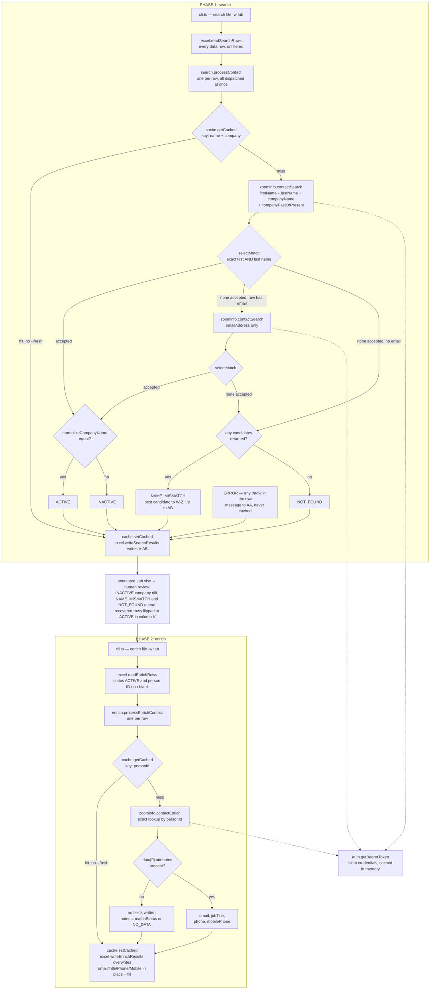

# Salesforce Contact Auditor — Architecture

A single-operator TypeScript CLI: two phases, each its own subcommand, each its own process. This
document explains the code; `README.md` is the operator's guide and is not repeated here.

---

## 1. Overview

The tool audits a Salesforce contact export (`.xlsx`, one worksheet tab per contact list) against
the ZoomInfo GTM Data API.

**Phase 1 — `search`** issues one Contact Search request per row (two when the email fallback fires)
on first name + last name + company, verifies the candidate's identity, compares ZoomInfo's
*present* employer against the sheet's company, and writes a status plus the matched ZoomInfo
details into new columns V–AB of `data/output/annotated_<worksheet>.xlsx`.

**Phase 2 — `enrich`** reads back an annotated sheet, keeps only rows marked `ACTIVE` with a person
ID, and looks each up by that ID — an exact lookup, no re-matching. Current email, title, phone and
mobile go into the sheet's *existing* columns, producing `data/output/enriched_<worksheet>.xlsx`.

The phases never chain automatically; between them sits human review of the `INACTIVE`,
`NAME_MISMATCH` and `NOT_FOUND` buckets.

| Status (column V) | Meaning |
| --- | --- |
| `ACTIVE` | Identity verified; normalized company names agree. |
| `INACTIVE` | Identity verified; ZoomInfo reports a different present employer. |
| `NAME_MISMATCH` | Candidates returned, none with an exact first + last name match. |
| `NOT_FOUND` | Neither search returned a candidate. |
| `ERROR` | The row's request threw; the message lands in `Tool Notes`. |

Out of scope: web UI, Salesforce write-back, database, job queue. Also absent: retry/backoff,
request batching, search pagination, DoNotCall checks.

---

## 2. Project layout

```
salesforce-contact-auditor/
├── src/
│   ├── cli.ts         # Entry point: dotenv, parseArgs, validation, routing, top-level error net
│   ├── search.ts      # Phase 1: runSearch, status derivation, name acceptance, company normalization
│   ├── enrich.ts      # Phase 2: runEnrich, enrich-response interpretation
│   ├── auth.ts        # getBearerToken: client-credentials token, single-flight in-memory cache
│   ├── zoominfo.ts    # Contact Search / Contact Enrich clients, their types, the request throttle
│   ├── excel.ts       # All workbook I/O and the column contract for both phases
│   └── cache.ts       # In-memory result store with JSON file load/save
├── dist/              # tsc output, gitignored. `npm start` runs dist/cli.js
├── data/              # GITIGNORED — real PII. input/ · output/ · cache/
├── docs/              # This file plus exported diagram renders (Architecture_Diagram.svg / .png)
├── .env               # CLIENT_ID / CLIENT_SECRET (.env.example is committed, placeholders only)
├── names.csv          # Nickname → formal-name lookup. Nothing in src/ reads it
└── README.md          # Operator guide
```

**Dependencies:** `exceljs` `^4.4.0` and `dotenv` `^17.4.2` at runtime; `typescript` `^7.0.2`, `tsx`
`^4.23.1`, `@types/node` `^26.1.1` in dev. HTTP is the global `fetch`; there is no CLI framework
(`parseArgs` from `node:util`), no validation library, no rate-limit library, and no test framework
(`npm test` is a placeholder).

**Toolchain.** `"type": "commonjs"`; `tsconfig.json` sets `target: ES2020`,
`module`/`moduleResolution: nodenext`, `strict: true`, `rootDir: src`, `outDir: dist`. Scripts: `dev`
= `tsx src/cli.ts`, `build` = `tsc`, `start` = `node dist/cli.js`. No `engines` field is declared;
Node 18 or newer is required in practice because the code calls global `fetch`.

**Filesystem contract.** Both cache paths and both output paths are relative, so runs start from the
repo root. No module creates directories — `data/cache/` and `data/output/` must already exist.

---

## 3. Architecture

```
runtime imports:                              type-only (erased at compile time,
                 cli.ts                        so there is no runtime cycle):
          (runSearch)   (runEnrich)           excel.ts --> search.ts  (SearchResult)
           search.ts     enrich.ts            cache.ts --> search.ts  (SearchResult)
           /   |   \     /   |   \            cache.ts --> excel.ts   (EnrichResult)
      excel  cache  zoominfo  cache  excel
        |             |
     exceljs       auth.ts --> global fetch
```

| Module | Responsibility | Key exports |
| --- | --- | --- |
| `cli.ts` | Parses argv, validates command/file/worksheet, dispatches, owns the single `.catch` and exit code. | none — runs `main().catch(...)` at module scope |
| `search.ts` | Phase 1 orchestration and every phase 1 rule: acceptance, normalization, status. | `runSearch` (also default export), `SearchResult` |
| `enrich.ts` | Phase 2 orchestration: cache lookup, enrich call, response interpretation, per-row error containment. | `runEnrich` |
| `zoominfo.ts` | Typed client for both endpoints; owns the throttle. | `contactSearch`, `contactEnrich`, the request/response interfaces, `ContactEnrichMatchStatus` |
| `auth.ts` | OAuth 2.0 client-credentials token, single-flight in-memory cache. | `getBearerToken` |
| `excel.ts` | All workbook I/O and the column contract. | `readSearchRows`, `writeSearchResults`, `readEnrichRows`, `writeEnrichResults`, `SearchRow`, `EnrichRow`, `EnrichResult` |
| `cache.ts` | One in-memory result record, loaded from and saved to a JSON file whose path is passed per call. | `loadCache`, `getCached`, `setCached`, `saveCache`, `buildSearchCacheKey`, `buildEnrichCacheKey` |

`SearchRow` is input and `SearchResult` is output; they share only `rowNumber`, the join key between
sheet and results. `personId` is a `string` everywhere in the codebase and becomes a `number` exactly
once, inside `contactEnrich`. Exported renders of the flow below live at
`docs/Architecture_Diagram.svg` / `.png`.



`cli.ts` validates per branch in a fixed order — input file present, `existsSync`, then
`--worksheet` — and rejects `--worksheet ""` like an omitted flag. Options are `--help`/`-h`,
`--worksheet`/`-w`, `--fresh`/`-f`, with `allowPositionals: true` and Node's default `strict: true`,
so an unrecognized option throws out of `parseArgs`.

---

## 4. Phase 1: search

### Input worksheet

`readSearchRows` requires four headers in row 1, matched by lowercased text at any position:
`first name`, `last name`, `account name`, `email` — lookup by header rather than by fixed letter,
because the real export hides columns. Every data row (2..`rowCount`) is returned, unfiltered; names
and company are read with `cell.value?.toString() ?? ''`, email with `cell.text`, which always
yields a string.

Layout of a contact tab in the real export (`B`, `E`, `K` are hidden in Excel, read normally through
ExcelJS). `search` never modifies A–U, including `L` (`Contact Status`), a CRM-managed field; V
onward must be free.

| Col | Header | Col | Header | Col | Header |
| --- | --- | --- | --- | --- | --- |
| A | Account Last Update | H | Account ID | O | Phone |
| B | Contact ID *(hidden)* | I | Account Name | P | Mobile |
| C | First Name | J | Account Owner | Q | Email |
| D | Last Name | K | Account: Created Date *(hidden)* | R | Last Modified By |
| E | Contact Name *(hidden)* | L | Contact Status | S | Last Modified Date |
| F | Created Date | M | Title | T | Email Opt Out |
| G | Created By | N | Department | U | NOTES |

### The request

`POST https://api.zoominfo.com/gtm/data/v1/contacts/search`, with `accept` and `content-type` both
`application/vnd.api+json`:

```jsonc
{
  "data": {
    "type": "ContactSearch",              // exact casing; "contactSearch" returns 400
    "attributes": {
      "firstName": "…", "lastName": "…", "companyName": "…",
      "companyPastOrPresent": "pastAndPresent"   // added only when companyName is truthy
    }
  }
}
```

`contactSearch` builds `attributes` from whatever criteria are not `undefined`, throwing
`"At least one search criteria must be provided"` if nothing survives. No paging or output-field
attributes are sent, so `data` is the API's default page and `meta.totalResults` is the only signal
that more exist. Two API behaviors shape the design:

- **The response reports the contact's present employer, not the company that caused the match.**
  Each candidate carries `attributes.company.{id,name}`, `attributes.jobTitle` and an `id` (the
  person ID), so matching on past *and* present employment while reading back the present company
  collapses "still there" and "moved on" into one call — the assumption the design rests on.
- **Search behaves like an AND across supplied fields**, so one stale field bundled with good ones
  sinks the match — hence sequential attempts with different field subsets rather than one combined
  request. The fallback field is `emailAddress`; `email` is not a valid field name and returns
  `400 PFAPI0005 "Invalid field requested"`.

### Acceptance and fallback

`selectMatch` accepts the first candidate whose first name **and** last name equal the row's,
compared with `toLocaleLowerCase()` + `trim()`, `undefined` coerced to `''`; all candidates are
scanned in returned order until one passes. Company, email, title and id play no part, and there is
no punctuation stripping, accent folding, nickname handling or fuzzy matching, so nicknames and
initials land in `NAME_MISMATCH` for a human. The strictness exists because phase 2 enriches by
`personId` and its output is reloaded into Salesforce — a wrong-person match does not merely
mislabel a row, it overwrites a real contact's data.

The email fallback fires when **no candidate was accepted** — not merely when none were returned —
and the row has a non-empty email. It sends `{ emailAddress }` alone and runs the same
`selectMatch`, so an email-matched record whose names differ is still rejected. If it also fails,
its candidates join the rejected list, deduplicated by candidate `id`. Afterwards the `notes` line
reports the *email* search's `meta.totalResults`.

### Status derivation

Evaluated in this order inside `processContact`:

| Condition | Status | Also recorded |
| --- | --- | --- |
| `!fresh` and a cache hit | the cached status | All cached fields verbatim except `rowNumber`, re-stamped from the current row. No API call, no re-cache. |
| No accepted match, no candidates from either search | `NOT_FOUND` | Nothing but `rowNumber` and `status`. Cached. |
| No accepted match, candidates present | `NAME_MISMATCH` | From `rejected[0]`: `personId`, `zi_company`, `zi_company_id`, `zi_title`; `notes` = `` `${rejected.length} candidate(s) rejected: name mismatch.` ``; `rejectedCandidates` = up to 5 entries as `First Last (Company)` joined with `'; '`, plus `; +N more`. Cached. |
| Accepted match, normalized companies equal | `ACTIVE` | `personId`, `zi_company`, `zi_company_id`, `zi_title` from the matched candidate. Cached. |
| Accepted match, normalized companies differ | `INACTIVE` | Same field set as `ACTIVE`. Cached. |
| Any throw inside the row's `try` | `ERROR` | `notes` = the error message. **Not cached**, so a re-run retries exactly the failures. |

On `ACTIVE` / `INACTIVE` rows, `notes` is set only when `meta.totalResults > 1`, to
`` `${totalResults} matches found; used the first name-verified one.` ``, and `rejectedCandidates`
is never set. `normalizeCompanyName` is used **only** for the `ACTIVE` / `INACTIVE` compare — never
for acceptance, never in the cache key: `toLocaleLowerCase()` → strip `.` and `,` → strip the
whole-word tokens `inc`, `incorporated`, `corp`, `corporation`, `llc`, `ltd`, `co`, `company` →
collapse whitespace → `trim()`, compared with strict `===`.

### Output columns

`writeSearchResults` re-opens the input workbook, writes the seven header labels into row 1, then
writes all seven cells for every result keyed by `rowNumber` — optional fields fall back to `''`, so
a re-run blanks stale values rather than leaving them. Rows absent from the results, columns A–U and
every other tab are untouched, and output goes to a different path (a guard rejects
`inputPath === outputPath`), so the annotated file is a drop-in replacement for the input. V and AA
are named `Inferred Contact Status` and `Tool Notes` rather than `Contact Status` / `Notes` so they
do not collide with Salesforce's own L and U headers, which anything keying on header text would
otherwise resolve ambiguously.

| Col | Header | Value written |
| --- | --- | --- |
| V | `Inferred Contact Status` | `result.status` |
| W | `ZoomInfo Person ID` | `result.personId ?? ''` — phase 2's key |
| X | `ZoomInfo Company Name` | `result.zi_company ?? ''` — lets a human sanity-check every `INACTIVE` |
| Y | `ZoomInfo Company ID` | `result.zi_company_id?.toString() ?? ''` — as text; Excel renders a long all-digit value as `1.40628E+10` when the cell is numeric |
| Z | `ZoomInfo Title` | `result.zi_title ?? ''` — free with search |
| AA | `Tool Notes` | `result.notes ?? ''` |
| AB | `ZoomInfo Rejected Candidates` | `result.rejectedCandidates ?? ''` |

`runSearch` logs `Read <n> contacts from <file>` and then
`Summary: <a> active, <b> inactive, <c> name mismatch, <d> not found, <e> errors`.

---

## 5. Phase 2: enrich

### Which rows qualify

`readEnrichRows` requires the headers `zoominfo person id` and `inferred contact status`, and keeps a
row only when the trimmed `Inferred Contact Status` equals exactly `ACTIVE` (case-sensitive, so
`Active` is skipped) **and** the trimmed `ZoomInfo Person ID` is non-empty. Everything else is
dropped silently, with no log line and no count; `enrich.ts` does no filtering itself.

That filter is the entire safety guard: nothing is enriched without either passing phase 1's
exact-name check or being explicitly flipped to `ACTIVE` by a person. A `NAME_MISMATCH` row already
carries the rejected candidate's `personId` in W, so flipping V is the only edit needed; a
`NOT_FOUND` or `ERROR` row has no person ID, so flipping V alone achieves nothing. Since those
headers exist only because phase 1 wrote them — and `writeEnrichResults` additionally requires
`tool notes` (AA) beside the export's own `email`, `title`, `phone`, `mobile` — **enrich cannot run
against a raw Salesforce export.**

### The request

`POST https://api.zoominfo.com/gtm/data/v1/contacts/enrich`, same JSON:API headers:

```jsonc
{
  "data": {
    "type": "ContactEnrich",
    "attributes": {
      "matchPersonInput": [{ "personId": 14062844524 }],   // one element, never batched
      "outputFields": ["email", "mobilePhone", "phone", "jobTitle"]
    }
  }
}
```

`contactEnrich` throws `"personId is required for contact enrichment"` on a falsy id and
`"personId must be a valid number"` when `Number(personId)` is `NaN`; that coercion is the
string→number boundary and doubles as sanitization for junk cell text.

### Response handling

Only `data[0]` is examined. The guard is `result.data.length === 0 || !result.data[0].attributes` —
ZoomInfo returns a record carrying a `meta.matchStatus` but **no `attributes` object at all** for
several match statuses, so a non-empty array does not imply fields are present.

- **Guard taken:** no fields written; `notes` becomes `data[0]?.meta?.matchStatus || 'NO_DATA'`, and
  the result is cached unconditionally.
- **Guard not taken:** the four fields below are copied out individually, and `notes` becomes the
  `matchStatus` unless it is `'FULL_MATCH'`, in which case `notes` is `undefined` so the ordinary
  success case leaves `Tool Notes` untouched. `COMPANY_ONLY_MATCH` and `CONTACT_ONLY_MATCH` are
  noted like any other non-`FULL_MATCH` value. Cached unless the status is `LIMIT_EXCEEDED`.

| API attribute | `EnrichResult` field | Destination column (by header) |
| --- | --- | --- |
| `email` | `email` | `email` |
| `jobTitle` | `jobTitle` | `title` |
| `phone` | `phone` | `phone` |
| `mobilePhone` | `mobilePhone` | `mobile` |
| `meta.matchStatus` | `notes` | `tool notes` |

### Write-back

Unlike search, which only appends, `writeEnrichResults` overwrites existing columns — located by
header name, never by letter — because the output is reloaded into Salesforce. Only truthy fields
are written, so a field ZoomInfo did not return leaves the cell as it was; nothing is ever blanked.
Each written value cell gets a light-orange fill (`pattern`/`solid`, argb `FFFDE9D9`) applied as
`cell.style = { ...cell.style, fill }` — **not** `cell.fill`, because cells loaded from a file can
share one style object and mutating it would paint every cell sharing that style. `Tool Notes` is
the exception: written directly with no fill, and *appended* — when the cell is non-empty the new
note is joined with `' | '`, so a note left by search survives.

`runEnrich` logs the post-filter row count and `Summary: <a> enriched, <b> no data, <c> errors`. The
tally keys on the notes string: a note starting with `Error` counts as an error, otherwise any of
the four fields being present counts as enriched, otherwise no-data — so a `FULL_MATCH` returning
none of the four counts as no-data.

---

## 6. Cross-cutting mechanisms

**Auth.** `auth.ts` runs the OAuth 2.0 client-credentials flow:
`POST https://api.zoominfo.com/gtm/oauth/v1/token`, `Authorization: Basic
base64(CLIENT_ID:CLIENT_SECRET)`, `Content-Type: application/x-www-form-urlencoded`, body
`grant_type=client_credentials`. Credentials come from `process.env`, populated by `cli.ts`'s
`import 'dotenv/config'`. Three module-level variables — `cachedToken`, `cachedTokenExpiresAt`,
`pendingFetch` — form a single-flight cache for the process. Expiry is
`Date.now() + expires_in*1000 - 60_000` (`EXPIRY_SAFETY_MARGIN_MS`), `expires_in` defaulting to
`3600` when absent. `pendingFetch` is assigned synchronously before any await, so under a
`Promise.all` fan-out the first caller starts the POST and every other joins the same promise
instead of stampeding the endpoint; a `.finally()` clears it on success and failure alike.
`getBearerToken` returns the bare token and `zoominfo.ts` builds the lowercase
`authorization: Bearer <token>` header. No disk persistence, no 401-triggered refresh, no retry —
expiry is decided purely by the clock, and one token fetch per run is normal.

**Throttle.** `zoominfo.ts` holds one module-level `nextSlot` cursor with
`MAX_REQUESTS_PER_SECOND = 20` and `MIN_INTERVAL_MS = 1000 / 20`, i.e. one slot every 50 ms, shared
by both endpoints:

```ts
const now = Date.now();
const wait = Math.max(0, nextSlot - now);
nextSlot = Math.max(now, nextSlot) + MIN_INTERVAL_MS;
if (wait > 0) await new Promise(resolve => setTimeout(resolve, wait));
```

The reservation happens **synchronously, before the await** — the only reason the limiter works
under `Promise.all`: N concurrent callers observe the advanced cursor and fan out to +50 ms,
+100 ms, +150 ms instead of all computing the same wait and firing together. `Math.max(now,
nextSlot)` stops an idle period from banking slots in the past. Both request functions order their
work `getBearerToken()` → `throttle()` → `fetch()`, so the token request is never throttled and the
fan-out is unbounded in promises but paced in HTTP requests.

**Cache.** `cache.ts` holds **one** module-level `Record<string, SearchResult | EnrichResult>`.
Nothing binds it to a path: the path is an argument to `loadCache` / `saveCache`, the key builder is
chosen by the caller (`buildSearchCacheKey` → `` `${firstName} ${lastName}|${company}` ``,
`buildEnrichCacheKey` → `` `personId:${personId}` ``), and the value type is chosen through
`getCached<T>`. Neither builder normalizes anything; search keys are case-sensitive and use the raw
company string. Separation of `data/cache/search_cache.store` from `data/cache/enrich_cache.store`
rests entirely on `cli.ts` running one phase per process. On-disk format is pretty-printed JSON
despite the `.store` extension, with no TTL, entry cap, eviction or schema version.

`loadCache` runs once before the fan-out, `saveCache` once after; `setCached` only mutates memory.
**No exported cache function can throw to its caller** — a missing, corrupt or unwritable store logs
and degrades to a cold or discarded cache, including a missing `data/cache/` directory, where the
run reports success having persisted nothing. `rowNumber` is re-stamped from the current row on
every hit (`{ ...cachedContact, rowNumber: contact.rowNumber }`): both keys are per-person, so a
cached entry's own `rowNumber` belongs to whichever row first populated the key, and reusing it
would misplace or blank duplicate rows on write. `--fresh` skips the cache *read*, not the write — a
fresh run still calls `setCached`, overwriting the entry.

**Concurrency and failure model.** One `Promise.all` per run over every row, created in a single
synchronous `map` pass, with no batching and no concurrency cap in either workflow module.
Consequently every cache lookup happens before any `setCached`, so two rows sharing a key both call
the API within a run — the cache only dedupes *across* runs. Serialized: the token fetch, the cache
load, the cache save, the workbook write.

| Scope | What lands there | Effect |
| --- | --- | --- |
| Per row | Non-OK HTTP, network or JSON-parse failure, token failure, bad criteria | `processContact` / `processEnrichContact` wrap their whole body in one `try`/`catch` that returns a value rather than rethrowing, so `Promise.all` never rejects. The row is written out as `status: 'ERROR'` with the message in `notes` (search), or with `notes` beginning `Error during enrichment: ` (enrich). `enrich.ts` also logs `Error processing contact: <error>` to stderr, with no row number or person ID. |
| Per run | CLI validation (missing/nonexistent input file, missing `--worksheet`, unknown command, anything `parseArgs` throws); read failures (worksheet not found — the error lists the workbook's real tab names — required header missing from row 1, no data rows, unreadable workbook); write failures (`inputPath === outputPath`, missing enrich output column, unwritable workbook, typically the output file being open in Excel) | Rejects the workflow promise, reaches `main().catch` in `cli.ts`, which prints the message plus the full usage text, then `process.exit(1)`. |

**Nothing is retried anywhere** — no backoff, no 429 or 5xx handling. A non-OK response costs that
row its result for that run, and error results are never cached in either phase, so a re-run retries
exactly the failures. The sharp edge: **an auth or API outage does not fail the run.** Every row
catches its own error, so a total outage yields a complete output workbook in which every row reads
`ERROR` or carries an `Error during enrichment: …` note, and the process still exits 0.

---

## 7. Design decisions

- **Exact name matching, not fuzzy.** Measured against the real data, edit-distance matching could
  rescue on the order of 35 rows per tab, while the exact-surname/divergent-first-name population
  (nicknames) is roughly four times larger and carries weaker identity evidence. Ambiguity goes to a
  human via `NAME_MISMATCH` rather than into the verified set phase 2 acts on.
- **Candidates are not sorted by `contactAccuracyScore`.** That score measures ZoomInfo's confidence
  in a profile's own data quality, not whether the profile is the person being searched for — it
  cannot separate two same-named people at one company any better than relevance can. The default
  `-relevance` order stands and multi-match rows are flagged in `Tool Notes` instead.
- **`NOT_FOUND` is distinct from `INACTIVE`.** A missing or misspelled company produces an empty
  response, identical in shape to "this person left" — same result, opposite meaning. Keeping them
  apart is what stops the tool from reporting good contacts as dead.
- **Enrich is a separate subcommand.** Contact Enrich is ZoomInfo's billable tier; an explicit
  command with its own required `--worksheet` can never fire as a side effect of `search`. One
  `cli.ts` routes both, validates at the boundary and owns the single top-level catch; workflow
  modules trust their inputs and communicate failure by throwing.
- **Phase 2 keys on `personId`.** Enrich accepts a person ID as match input, making phase 2 an exact
  lookup. Keying on anything else would redo phase 1's matching from scratch and could reach a
  *different* answer than phase 1 did — against records it then overwrites.
- **Rejected candidates are surfaced, not guessed at.** `NAME_MISMATCH` rows keep the first rejected
  candidate's details in W–Z plus a formatted list in AB, so a reviewer who confirms the person has
  the ID in hand with no re-search. That ID is unverified by definition, which is safe only because
  phase 2 consumes `ACTIVE` rows exclusively.
- **Search appends; enrich overwrites.** Search's columns are new, so they are addressed by fixed
  letters and written unconditionally; enrich's targets are pre-existing Salesforce columns, found
  by header name and written only when ZoomInfo returned a value.
- **No phone fallback, no DoNotCall handling.** Search falls back to email only.
  `directPhoneDoNotCall` / `mobilePhoneDoNotCall` are never requested or checked, and phone and
  mobile are written whenever returned — the manual process this tool replaces did not gate on the
  DNC flag either, and enforcement belongs to Salesforce's DNC settings once the sheet is reloaded.

---

## 8. Known limitations

**Company names do not match across systems** — the main soft spot. `Acme Corp` · `Acme Corporation`
· `Acme Corp.` · `ACME`: Salesforce and ZoomInfo disagree, and a strict compare marks an active
contact `INACTIVE`. `normalizeCompanyName` absorbs casing, `.`/`,` and eight suffix tokens; it
cannot bridge abbreviations, rebrands or parent/subsidiary naming, and the residual
false-`INACTIVE` population is too large to eyeball. The mitigation lives in the data rather than
the code: column X carries ZoomInfo's company name and Y its `company.id`, so an adjudication pass
can diff the input `Account Name` (I) against X with Y as a ground-truth tiebreaker. Such a pass
should escalate ambiguous cases to a human rather than auto-recover, so a genuine job change is not
silently promoted back into the `ACTIVE` set; a recovered row already carries its `personId`.

- **Cache staleness after a logic change.** Cached verdicts are served verbatim and carry no version
  stamp, so changing matching logic — normalization, fallback, name rules, enrich output fields —
  requires deleting the relevant `.store` file or running with `--fresh`. Elapsed time is also a
  reason: ZoomInfo's data drifts on its own schedule.
- **The cache only persists at end of run.** `saveCache` runs once, after `Promise.all` settles, so
  killing a run partway loses every result it gathered, including completed API calls. Let a run
  finish — even a buggy one, if it is not actively corrupting data.
- **The search cache key omits email.** Two rows with the same name and company but different emails
  can legitimately get different answers via the fallback; the key collapses them to whichever was
  cached last, so a warm run can differ from a cold run by a row or two. Adding `email` to
  `buildSearchCacheKey` is the fix if exact cold/warm reproducibility is needed.
- **`NOT_FOUND` is an upper bound.** It asserts only that name+company and the email fallback both
  came back empty; rows with no email get one attempt.
- **Responses are `as`-cast, never validated.** A malformed or error-shaped 200 body flows through
  as if it matched the declared type; the first property access downstream is where it fails.
  `getCached`'s cast is likewise unchecked, and `loadCache` verifies only that the parsed JSON is a
  non-null object. Search reads whatever the default page returns; enrich reads only `data[0]`.
- **A `LIMIT_EXCEEDED` enrich response that also lacks `attributes`** takes the guard branch, which
  caches unconditionally, so it is stored under that `personId` and replayed by a later
  non-`--fresh` run.
- **Enrich's output-column check runs late.** `writeEnrichResults` calls `requireColumns` inside the
  mutate callback, so a missing `email` / `title` / `phone` / `mobile` / `tool notes` header fails
  the run *after* every API call has been spent and after the cache has been saved.
- **Output filenames interpolate the worksheet name only**, never the input filename, so two input
  workbooks with the same tab name overwrite each other's output.
- **Smaller edges.** The `inputPath === outputPath` guard is plain string equality, so two spellings
  of one path slip through. Duplicate header text in row 1 resolves to the last matching column.
  `names.csv` is committed for a future nickname rule but nothing in `src/` reads it.
